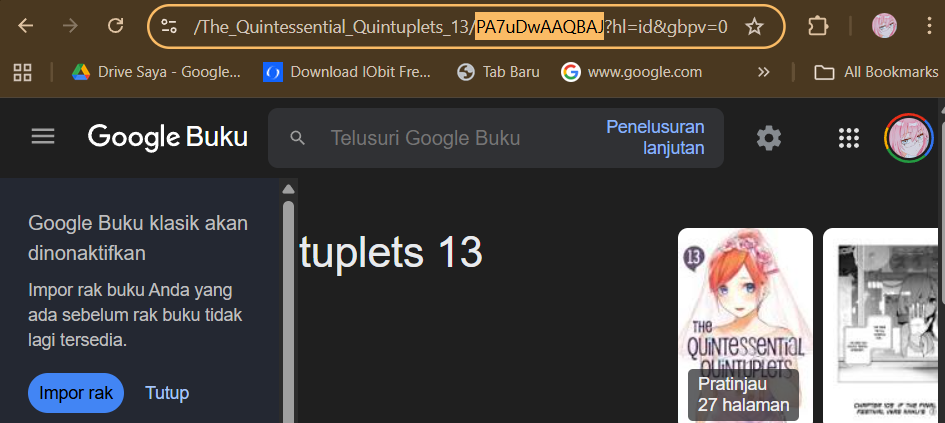
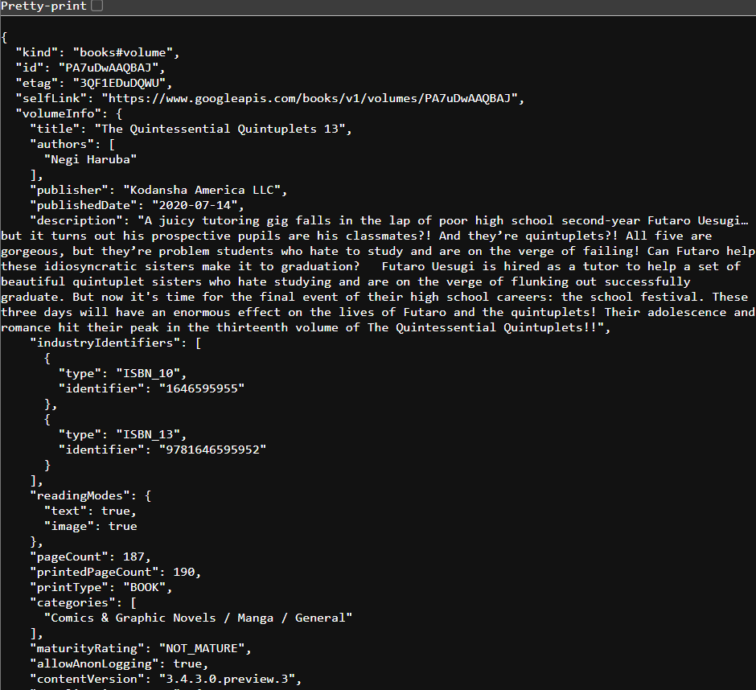
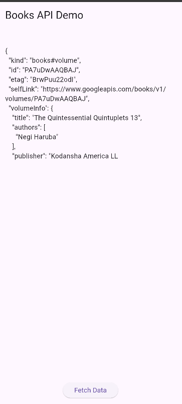

# codelab_11

# Practical 1: Downloading Data from Web Service (API)

## Step 1: Create a New Project
Create a new flutter project named books in the src folder of your GitHub repository week-11 .

Then Add dependencies httpby typing the following command in the terminal.


## Step 2: Check the filepubspec.yaml
If the plugin is successfully installed, make sure the plugin httpis in pubspecthis file as follows.
```dart:
dependencies:
  flutter:
    sdk: flutter

  # The following adds the Cupertino Icons font to your application.
  # Use with the CupertinoIcons class for iOS style icons.
  cupertino_icons: ^1.0.8
  http: ^1.1.0
```

## Step 3: Open the filemain.dart
Type the code as follows.
```dart:
import 'package:flutter/material.dart';
import 'package:http/http.dart' as http;

void main() {
  runApp(const BooksApp());
}

class BooksApp extends StatelessWidget {
  const BooksApp({super.key});

  @override
  Widget build(BuildContext context) {
    return MaterialApp(
      title: 'Books App - Agna',  //  Question 1
      debugShowCheckedModeBanner: false,
      home: const FuturePage(),
    );
  }
}

class FuturePage extends StatefulWidget {
  const FuturePage({super.key});

  @override
  State<FuturePage> createState() => _FuturePageState();
}

class _FuturePageState extends State<FuturePage> {
  String result = "";
  bool loading = false;

  //  STEP 4 — getData()
  Future<String> getData() async {
    String path = "https://www.googleapis.com/books/v1/volumes/BOOK_ID"; 
    //  Question 2: Ganti BOOK_ID dengan ID buku favoritmu

    final response = await http.get(Uri.parse(path));

    if (response.statusCode == 200) {
      return response.body;
    } else {
      throw Exception("Failed to load data");
    }
  }

  @override
  Widget build(BuildContext context) {
    return Scaffold(
      appBar: AppBar(
        title: const Text("Books API Demo"),
      ),
      body: Center(
        child: Padding(
          padding: const EdgeInsets.all(16),
          child: Column(
            children: [
              if (loading) const CircularProgressIndicator(),
              const SizedBox(height: 20),

              Expanded(
                child: SingleChildScrollView(
                  child: SelectableText(result),
                ),
              ),

              //  STEP 5 — onPressed
              ElevatedButton(
                onPressed: () {
                  setState(() {
                    loading = true;
                    result = "";
                  });

                  getData()
                      .then((data) {
                        //  substring → sesuai instruksi
                        String preview = data.length > 300
                            ? data.substring(0, 300)
                            : data;

                        setState(() {
                          result = preview;
                        });
                      })
                      .catchError((err) {
                        setState(() {
                          result = "Error: $err";
                        });
                      })
                      .whenComplete(() {
                        setState(() {
                          loading = false;
                        });
                      });
                },
                child: const Text("Fetch Data"),
              ),
            ],
          ),
        ),
      ),
    );
  }
}
```
- Question 1
Add your nickname to titlethe app as an identity for your work.
```dart:
  @override
  Widget build(BuildContext context) {
    return MaterialApp(
      title: 'Books App - Agna',  //  Question 1
      debugShowCheckedModeBanner: false,
      home: const FuturePage(),
    );
  }
```

## Step 4: Add methodgetData()
Add this method to your <your> class _FuturePageStatethat is useful for retrieving data from the Google Books API.
```dart:
  //  STEP 4 — getData()
  Future<String> getData() async {
    String path = "https://www.googleapis.com/books/v1/volumes/PA7uDwAAQBAJ"; 
    //  Question 2: Ganti BOOK_ID dengan ID buku favoritmu

    final response = await http.get(Uri.parse(path));

    if (response.statusCode == 200) {
      return response.body;
    } else {
      throw Exception("Failed to load data");
    }
  }
```
- Question 2
Search for your favorite book title in Google Books, then replace the book ID with the variable pathin the code. To do this, simply access the URL in your browser, as shown in the image below.


- Then, try accessing the complete URI in a browser like this. If it displays JSON data, you've succeeded. Capture your output and write it in READMEyour lab report. Then, commit the file with the message " W11: Question 2. "


## Step 5: Add the code inElevatedButton
Add code to onPressedthe following ElevatedButton.
```dart:
//  STEP 5 — onPressed
              ElevatedButton(
                onPressed: () {
                  setState(() {
                    loading = true;
                    result = "";
                  });

                  getData()
                      .then((data) {
                        //  substring → sesuai instruksi
                        String preview = data.length > 300
                            ? data.substring(0, 300)
                            : data;

                        setState(() {
                          result = preview;
                        });
                      })
                      .catchError((err) {
                        setState(() {
                          result = "Error: $err";
                        });
                      })
                      .whenComplete(() {
                        setState(() {
                          loading = false;
                        });
                      });
                },
                child: const Text("Fetch Data"),
              ),                  
```
- Question 3
Explain the meaning of the code in step 5 and related substringto it catchError!
1. The substring() function

Substring() is used to:

Extract only a portion of JSON (e.g., 0–300 characters).
To prevent the UI from becoming too long.
It doesn't change the original data — it just limits what is displayed.
```dart:
String preview = data.length > 300
    ? data.substring(0, 300)
    : data;
```

2. The catchError() function

catchError() is used to catch errors that occur when the Future is executed.

Example error cases:

    a. Incorrect book ID

    b. No internet connection

    c. Server error

    d. HTTP status ≠ 200
```dart:
.catchError((err) {
  setState(() {
    result = "Error: $err";
  });
})
```
Capture your lab results as a GIF and attach it to the README. Then, commit the project with the message " W11: Question 3. "
<video controls src="books/images/prac1/5.mp4" title="Title"></video>

this the pict with correct code:


# Practical 2: Using await/async to avoid callbacks

## Step 1: Open the filemain.dart
Add three methods containing code like the following inside class _FuturePageState.
```dart:
  //  LAB 2 — STEP 1: Tambahkan 3 method async
  Future<int> returnOneAsync() async {
    await Future.delayed(const Duration(seconds: 3));
    return 1;
  }

  Future<int> returnTwoAsync() async {
    await Future.delayed(const Duration(seconds: 3));
    return 2;
  }

  Future<int> returnThreeAsync() async {
    await Future.delayed(const Duration(seconds: 3));
    return 3;
  }
```

## Step 2: Add methodcount()
Then add this method again below the previous three methods.
```dart:
  //  LAB 2 — STEP 2: Tambahkan method count()
  Future<int> count() async {
    int total = 0;

    total += await returnOneAsync();   // 3 detik
    total += await returnTwoAsync();   // 3 detik
    total += await returnThreeAsync(); // 3 detik

    return total; 
  }
```

## Step 3: Callcount()
Comment out the previous code, change the contents of the code onPressed()to be as follows.
```dart:
                //  LAB 2 — STEP 3
                // Hapus kode lama, ganti dengan count()
                // ============================
                onPressed: () async {
                  setState(() {
                    loading = true;
                    result = "";
                  });

                  int value = await count(); // total 9 detik

                  setState(() {
                    result = "Result: $value"; // hasil = 6
                    loading = false;
                  });
                },
                child: const Text("Count (9 seconds)"),
```