# codelab_11

# Practical 1: Downloading Data from Web Service (API)

## Step 1: Create a New Project
Create a new flutter project named books in the src folder of your GitHub repository week-11 .

Then Add dependencies httpby typing the following command in the terminal.


## Step 2: Check the filepubspec.yaml
If the plugin is successfully installed, make sure the plugin httpis in pubspecthis file as follows.
```dart:
dependencies:
  flutter:
    sdk: flutter

  # The following adds the Cupertino Icons font to your application.
  # Use with the CupertinoIcons class for iOS style icons.
  cupertino_icons: ^1.0.8
  http: ^1.1.0
```

## Step 3: Open the filemain.dart
Type the code as follows.
```dart:
import 'package:flutter/material.dart';
import 'package:http/http.dart' as http;

void main() {
  runApp(const BooksApp());
}

class BooksApp extends StatelessWidget {
  const BooksApp({super.key});

  @override
  Widget build(BuildContext context) {
    return MaterialApp(
      title: 'Books App - Agna',  //  Question 1
      debugShowCheckedModeBanner: false,
      home: const FuturePage(),
    );
  }
}

class FuturePage extends StatefulWidget {
  const FuturePage({super.key});

  @override
  State<FuturePage> createState() => _FuturePageState();
}

class _FuturePageState extends State<FuturePage> {
  String result = "";
  bool loading = false;

  //  STEP 4 — getData()
  Future<String> getData() async {
    String path = "https://www.googleapis.com/books/v1/volumes/BOOK_ID"; 
    //  Question 2: Ganti BOOK_ID dengan ID buku favoritmu

    final response = await http.get(Uri.parse(path));

    if (response.statusCode == 200) {
      return response.body;
    } else {
      throw Exception("Failed to load data");
    }
  }

  @override
  Widget build(BuildContext context) {
    return Scaffold(
      appBar: AppBar(
        title: const Text("Books API Demo"),
      ),
      body: Center(
        child: Padding(
          padding: const EdgeInsets.all(16),
          child: Column(
            children: [
              if (loading) const CircularProgressIndicator(),
              const SizedBox(height: 20),

              Expanded(
                child: SingleChildScrollView(
                  child: SelectableText(result),
                ),
              ),

              //  STEP 5 — onPressed
              ElevatedButton(
                onPressed: () {
                  setState(() {
                    loading = true;
                    result = "";
                  });

                  getData()
                      .then((data) {
                        //  substring → sesuai instruksi
                        String preview = data.length > 300
                            ? data.substring(0, 300)
                            : data;

                        setState(() {
                          result = preview;
                        });
                      })
                      .catchError((err) {
                        setState(() {
                          result = "Error: $err";
                        });
                      })
                      .whenComplete(() {
                        setState(() {
                          loading = false;
                        });
                      });
                },
                child: const Text("Fetch Data"),
              ),
            ],
          ),
        ),
      ),
    );
  }
}
```
- Question 1
Add your nickname to titlethe app as an identity for your work.
```dart:
  @override
  Widget build(BuildContext context) {
    return MaterialApp(
      title: 'Books App - Agna',  //  Question 1
      debugShowCheckedModeBanner: false,
      home: const FuturePage(),
    );
  }
```

## Step 4: Add methodgetData()
Add this method to your <your> class _FuturePageStatethat is useful for retrieving data from the Google Books API.
```dart:
  //  STEP 4 — getData()
  Future<String> getData() async {
    String path = "https://www.googleapis.com/books/v1/volumes/PA7uDwAAQBAJ"; 
    //  Question 2: Ganti BOOK_ID dengan ID buku favoritmu

    final response = await http.get(Uri.parse(path));

    if (response.statusCode == 200) {
      return response.body;
    } else {
      throw Exception("Failed to load data");
    }
  }
```
- Question 2
Search for your favorite book title in Google Books, then replace the book ID with the variable pathin the code. To do this, simply access the URL in your browser, as shown in the image below.


- Then, try accessing the complete URI in a browser like this. If it displays JSON data, you've succeeded. Capture your output and write it in READMEyour lab report. Then, commit the file with the message " W11: Question 2. "


## Step 5: Add the code inElevatedButton
Add code to onPressedthe following ElevatedButton.
```dart:
//  STEP 5 — onPressed
              ElevatedButton(
                onPressed: () {
                  setState(() {
                    loading = true;
                    result = "";
                  });

                  getData()
                      .then((data) {
                        //  substring → sesuai instruksi
                        String preview = data.length > 300
                            ? data.substring(0, 300)
                            : data;

                        setState(() {
                          result = preview;
                        });
                      })
                      .catchError((err) {
                        setState(() {
                          result = "Error: $err";
                        });
                      })
                      .whenComplete(() {
                        setState(() {
                          loading = false;
                        });
                      });
                },
                child: const Text("Fetch Data"),
              ),                  
```
- Question 3
Explain the meaning of the code in step 5 and related substringto it catchError!
1. The substring() function

Substring() is used to:

Extract only a portion of JSON (e.g., 0–300 characters).
To prevent the UI from becoming too long.
It doesn't change the original data — it just limits what is displayed.
```dart:
String preview = data.length > 300
    ? data.substring(0, 300)
    : data;
```

2. The catchError() function

catchError() is used to catch errors that occur when the Future is executed.

Example error cases:

    a. Incorrect book ID

    b. No internet connection

    c. Server error

    d. HTTP status ≠ 200
```dart:
.catchError((err) {
  setState(() {
    result = "Error: $err";
  });
})
```
Capture your lab results as a GIF and attach it to the README. Then, commit the project with the message " W11: Question 3. "
<video controls src="books/images/prac1/5.mp4" title="Title"></video>

this the pict with correct code:


# Practical 2: Using await/async to avoid callbacks

## Step 1: Open the filemain.dart
Add three methods containing code like the following inside class _FuturePageState.
```dart:
  //  LAB 2 — STEP 1: Tambahkan 3 method async
  Future<int> returnOneAsync() async {
    await Future.delayed(const Duration(seconds: 3));
    return 1;
  }

  Future<int> returnTwoAsync() async {
    await Future.delayed(const Duration(seconds: 3));
    return 2;
  }

  Future<int> returnThreeAsync() async {
    await Future.delayed(const Duration(seconds: 3));
    return 3;
  }
```

## Step 2: Add methodcount()
Then add this method again below the previous three methods.
```dart:
  //  LAB 2 — STEP 2: Tambahkan method count()
  Future<int> count() async {
    int total = 0;

    total += await returnOneAsync();   // 3 detik
    total += await returnTwoAsync();   // 3 detik
    total += await returnThreeAsync(); // 3 detik

    return total; 
  }
```

## Step 3: Callcount()
Comment out the previous code, change the contents of the code onPressed()to be as follows.
```dart:
                //  LAB 2 — STEP 3
                // Hapus kode lama, ganti dengan count()
                // ============================
                onPressed: () async {
                  setState(() {
                    loading = true;
                    result = "";
                  });

                  int value = await count(); // total 9 detik

                  setState(() {
                    result = "Result: $value"; // hasil = 6
                    loading = false;
                  });
                },
                child: const Text("Count (9 seconds)"),
```

## Step 4: Run
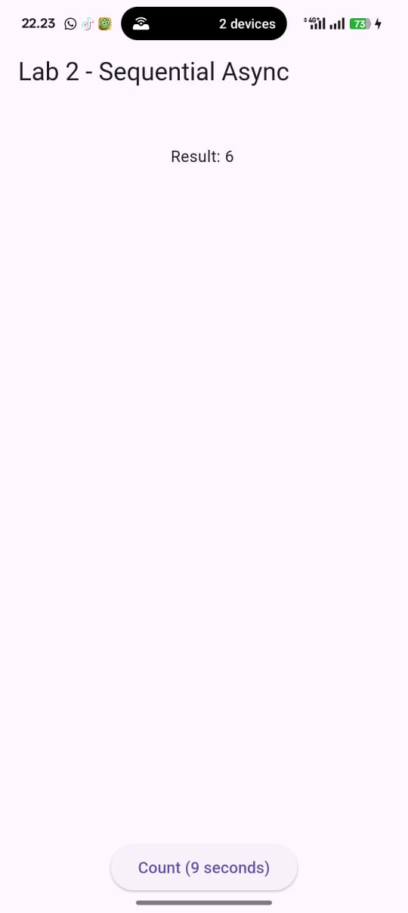


Question 4
- Explain the meaning of the code steps 1 and 2!
Meaning of Step 1 (three async methods)

In Step 1, you created three asynchronous functions:

  - returnOneAsync() → delay 3 seconds → return 1
    returnTwoAsync() → delay 3 seconds → return 2
    returnThreeAsync() → delay 3 seconds → return 3

Goal:
Simulate asynchronous tasks that take time (e.g., API or database operations). Because you use await Future.delayed(), the UI doesn't freeze; it just waits for the process to complete.

Capture your lab results as a GIF and attach it to the README. Then, commit the project with the message " W11: Question 4. "
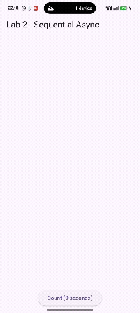

# Lab 3: Using Completer in Future

## Step 1: Openmain.dart 
Make sure you have imported the following async packages.
```dart:
import 'package:async/async.dart';
```

## Step 2: Add variables and methods
Add late variables and methods class _FuturePageStatelike this.
```dart:
late Completer completer;

  Future getNumber() {
    completer = Completer<int>();  
    calculate();       
    return completer.future;  
  }

  Future calculate() async {
    await Future.delayed(const Duration(seconds: 5));
    completer.complete(42);      //  hasil muncul setelah 5 detik
  }
```

## Step 3: Change the code contentonPressed()
Add the following code to the function onPressed(). You can comment out the previous code .
```dart:
              //  Lab 3 — STEP 3
              ElevatedButton(
                onPressed: () async {
                  setState(() {
                    loading = true;
                    result = "";
                  });

                  var value = await getNumber();  

                  setState(() {
                    result = value.toString();  //  tampilkan "42"
                    loading = false;
                  });
                },
                child: const Text("Run Completer (5 seconds)"),
              ),
```

## Step 4
Finally, run the program or press F5 to see the results if it's not already running. You can also perform a hot restart if the application is already running. The results will look like the image below. After 5 seconds, the number 42 will appear.
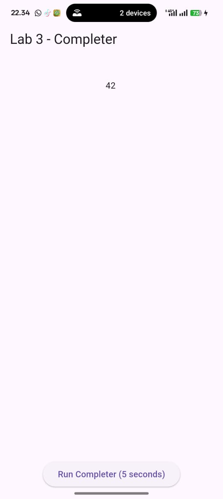

- Question 5
Explain the meaning of the code in step 2!
Step 2 shows how to manually create a Future using a Completer.
getNumber() creates a Completer and returns its Future, while calculate() completes the Future after 5 seconds by calling complete(42).

Capture your lab results as a GIF and attach it to the README. Then, commit the project with the message " W11: Question 5. "
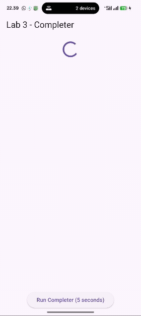

## Step 5: Change methodcalculate()
Change the contents of the method code calculate()like the following code, or you can createcalculate2()
```dart:
  //  LAB 3 — STEP 5: ubah isi calculate()
  Future calculate() async {
    await Future.delayed(const Duration(seconds: 5));

    //  Menghasilkan error
    completer.completeError("An error occurred");
  }
```

## Step 6: Move toonPressed()
Change it to the following code.
```dart:
//  LAB 3 — STEP 6: Gunakan then() + catchError()
              ElevatedButton(
                onPressed: () {
                  setState(() {
                    loading = true;
                    result = "";
                  });

                  getNumber().then((value) {
                    setState(() {
                      result = value.toString();  // Jika success
                      loading = false;
                    });
                  }).catchError((e) {
                    setState(() {
                      result = "An error occurred"; // Jika error
                      loading = false;
                    });
                  });
                },
                child: const Text("Run Completer (Error Handling)"),
              ),
```
Result:
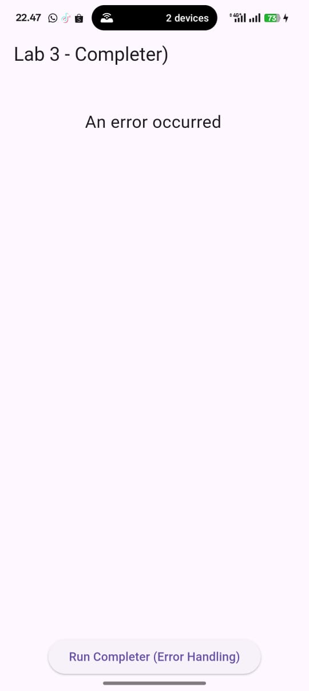

- Question 6
Explain the difference between the code for step 2 and steps 5-6!
1. Difference in how the Future is completed
Step 2
```dart: 
completer.complete(42);
```
  - The Future is always completed successfully.
  - It always returns the value 42.
  - There is no error scenario in Step 2.
  - This represents a normal asynchronous task that finishes without failure.


Steps 5–6
```dart:
completer.completeError("An error occurred");
```
  - The Future is completed as an error, not success.
  - This allows us to simulate a failure condition and test error handling.
  - Used to demonstrate how Flutter handles asynchronous errors.

2. Difference in how the Future is consumed
Step 2 — using async/await
```dart:
var value = await getNumber();
result = value.toString();
```
  - Uses async/await, which reads like synchronous code.
  - Error handling would require try/catch (but the code in Step 2 does not  include error handling).
  - Suitable for tasks that normally succeed.

Steps 5–6 — using then() and catchError()
```dart:
getNumber().then((value) {
  result = value.toString();
}).catchError((e) {
  result = 'An error occurred';
});
```
  - Uses Future chaining with .then() and .catchError().
  -.catchError() handles errors thrown by the Future.
  - Suitable when the Future may fail (e.g., network error or invalid data).

Capture your lab results as a GIF and attach it to the README. Then, commit the project with the message " W11: Question 6. "
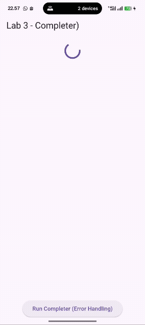

# Practical 4: Calling Future in parallel

## Step 1: Open the filemain.dart
Add this method to yourclass _FuturePageState
```dart:
//  LAB 4 — STEP 1
  //     Using FutureGroup exactly as your instructions
 

  void returnFG() {
    setState(() {
      loading = true;
      result = "";
    });

    FutureGroup<int> futureGroup = FutureGroup<int>();

    futureGroup.add(returnOneAsync());
    futureGroup.add(returnTwoAsync());
    futureGroup.add(returnThreeAsync());

    futureGroup.close();

    futureGroup.future.then((List<int> value) {
      int total = 0;

      for (var element in value) {
        total += element;
      }

      setState(() {
        result = total.toString();   // expected: "6"
        loading = false;
      });
    });
  }
```

## Step 2: EditonPressed()
You can delete or comment out the previous code, then call the method from step 1.
```dart:
 //  LAB 4 — STEP 2
              //     onPressed calls returnFG()
              ElevatedButton(
                onPressed: () {
                  returnFG();    //  EXACT instruction
```

## Step 3: Run
You will see the results in 3 seconds in the form of the number 6, faster than the previous practical, which took 9 seconds.
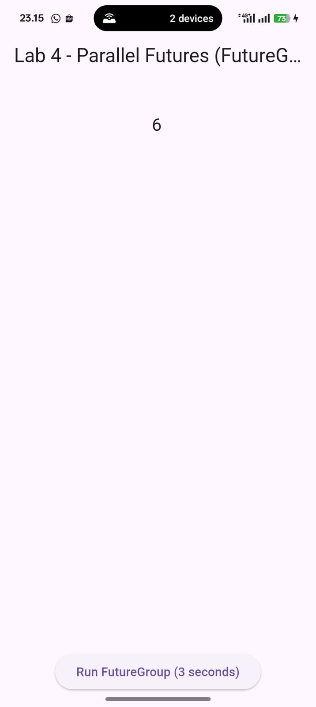

- Question 7
Capture your lab results as a GIF and attach it to the README. Then, commit the project with the message " W11: Question 7. "
<video controls src="books/images/prac4/2.mp4" title="Title"></video>

## Step 4: Change variablesfutureGroup
You can use FutureGroup with Future.waitthe following code.
```dart:
//  LAB 4 — STEP 4: Using Future.wait
 

  void returnWait() async {
    setState(() {
      loading = true;
      result = "";
    });

    final futures = await Future.wait<int>([
      returnOneAsync(),
      returnTwoAsync(),
      returnThreeAsync(),
    ]);

    int total = futures.reduce((a, b) => a + b);

    setState(() {
      result = total.toString(); // expected: 6
      loading = false;
    });
  }
```
- Question 8
Explain the meaning of the difference between code steps 1 and 4!
Question 8

Explain the meaning of the difference between code steps 1 and 4.
Answer:
Step 1 — FutureGroup

  - Comes from package:async.
  - Futures can be added dynamically using futureGroup.add().
  - Must call futureGroup.close() to signal completion.
  - More flexible for scenarios where the number of tasks is not known in advance.

Step 4 — Future.wait

  - Comes from Dart’s built-in dart:async library.
  - Requires a fixed list of Futures known before execution.
  - Starts all Futures immediately and waits for all of them.
  - Much simpler and cleaner than using FutureGroup.

Result:
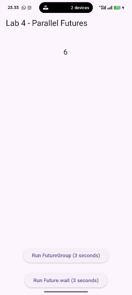

# Practical 5: Handling Error Responses in Async Code

## Step 1: Open the filemain.dart
Add this method to yourclass _FuturePageState
```dart:
  //  LAB 5 — STEP 1: returnError()
  Future returnError() async {
    await Future.delayed(const Duration(seconds: 2));
    throw Exception('Something terrible happened!');
  }
```

## Step 2: ElevatedButton
Replace with the following code
```dart:
//  LAB 5 — STEP 2 BUTTON
              ElevatedButton(
                onPressed: () {
                  setState(() {
                    loading = true;
                    result = "";
                  });

                  returnError()
                      .then((value) {
                        setState(() {
                          result = 'Success';
                          loading = false;
                        });
                      })
                      .catchError((onError) {
                        setState(() {
                          result = onError.toString();
                          loading = false;
                        });
                      })
                      .whenComplete(() => print('Complete'));
                },
                child: const Text("GO!"),
              ),
```

## Step 3: Run
Run it and click the GO! button , then the results will be as shown in the following image.
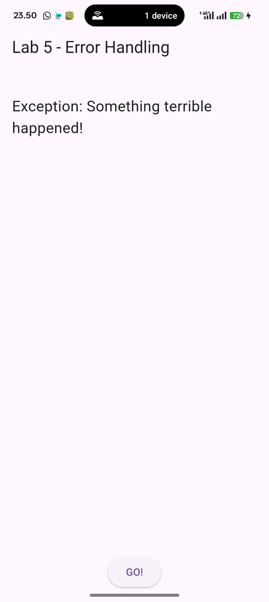
In the debug console section you will see text Completelike the following.
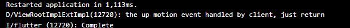

- Question 9
Capture your lab results as a GIF and attach it to the README. Then, commit the project with the message " W11: Question 9. "
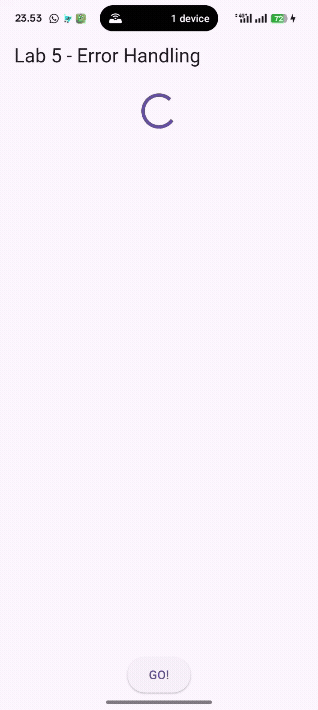

## Step 4: Add methodhandleError()
Add this code insideclass _FutureStatePage
```dart:
// ============================================================
  //  LAB 5 — STEP 4: handleError() EXACTLY as provided
  // ============================================================

  Future handleError() async {
    try {
      await returnError(); // error thrown here
    } catch (error) {
      setState(() {
        result = error.toString();   // show the caught error
      });
    } finally {
      print('Complete');             // printed every time
    }
  }
```

- Question 10
Call handleError()the method in ElevatedButton, then run it. What is the result? Explain the difference between the code in steps 1 and 4!

*answer*:
Call the `handleError()` method using an `ElevatedButton`, then run the app.  
Observe the output and explain the difference between the code in **Step 1** and **Step 4**.

Explanation
Step 1
  - No try-catch-finally block.
  - When an error occurs, it causes the app to throw an unhandled exception.
  - The app stops execution and may crash.
  - No "Complete" message printed since the code stops after the error.

Step 4
  - Uses try-catch-finally structure.
  - The catch block handles the exception, preventing app crashes.
  - The error message is displayed in the app’s UI via setState().
  - The finally block executes no matter what, printing "Complete" to the console.

main.dart:
```dart:
import 'dart:async';
import 'package:flutter/material.dart';
import 'package:http/http.dart' as http;
import 'package:async/async.dart';

void main() {
  runApp(const BooksApp());
}

class BooksApp extends StatelessWidget {
  const BooksApp({super.key});

  @override
  Widget build(BuildContext context) {
    return MaterialApp(
      title: 'Books App - Agna',
      debugShowCheckedModeBanner: false,
      home: const FuturePage(),
    );
  }
}

class FuturePage extends StatefulWidget {
  const FuturePage({super.key});

  @override
  State<FuturePage> createState() => _FuturePageState();
}

class _FuturePageState extends State<FuturePage> {
  String result = "";
  bool loading = false;

  // ============================================================
  //  LAB 1 (commented)
  // ============================================================
  /*
  Future<String> getData() async {...}
  */

  // ============================================================
  //  LAB 2 (commented)
  // ============================================================
  /*
  Future<int> returnOneAsync() async {...}
  Future<int> returnTwoAsync() async {...}
  Future<int> returnThreeAsync() async {...}
  Future<int> count() async {...}
  */

  // ============================================================
  //  LAB 3 (commented)
  // ============================================================
  /*
  late Completer completer;
  Future getNumber() {...}
  Future calculate() {...}
  */

  // ============================================================
  //  LAB 4 (commented)
  // ============================================================
  /*
  void returnFG() {...}
  void returnWait() {...}
  */

  // ============================================================
  //  LAB 5 — STEP 1: returnError()
  // ============================================================

  Future returnError() async {
    await Future.delayed(const Duration(seconds: 2));
    throw Exception('Something terrible happened!');
  }

  // ============================================================
  //  LAB 5 — STEP 4: handleError() EXACTLY as provided
  // ============================================================

  Future handleError() async {
    try {
      await returnError(); // error thrown here
    } catch (error) {
      setState(() {
        result = error.toString();   // show the caught error
      });
    } finally {
      print('Complete');             // printed every time
    }
  }

  // ============================================================

  @override
  Widget build(BuildContext context) {
    return Scaffold(
      appBar: AppBar(
        title: const Text("Lab 5 - Error Handling"),
      ),
      body: Center(
        child: Padding(
          padding: const EdgeInsets.all(16),
          child: Column(
            children: [
              if (loading) const CircularProgressIndicator(),

              const SizedBox(height: 20),

              Expanded(
                child: SingleChildScrollView(
                  child: SelectableText(
                    result,
                    style: const TextStyle(fontSize: 20),
                  ),
                ),
              ),

              const SizedBox(height: 20),

              // ============================================================
              //  LAB 5 — STEP 2 BUTTON (then/catchError/whenComplete)
              // ============================================================

              ElevatedButton(
                onPressed: () {
                  setState(() {
                    loading = true;
                    result = "";
                  });

                  returnError()
                      .then((value) {
                        setState(() {
                          result = 'Success';
                          loading = false;
                        });
                      })
                      .catchError((onError) {
                        setState(() {
                          result = onError.toString();
                          loading = false;
                        });
                      })
                      .whenComplete(() => print('Complete'));
                },
                child: const Text("GO! (then/catchError)"),
              ),

              const SizedBox(height: 20),

              // ============================================================
              //  LAB 5 — STEP 4 BUTTON (handleError with try/catch/finally)
              // ============================================================

              ElevatedButton(
                onPressed: () {
                  setState(() {
                    loading = true;
                    result = "";
                  });

                  handleError().whenComplete(() {
                    setState(() {
                      loading = false;
                    });
                  });
                },
                child: const Text("Run handleError()"),
              ),
            ],
          ),
        ),
      ),
    );
  }
}
```
result:


In the debug console section you will see text Completelike the following.
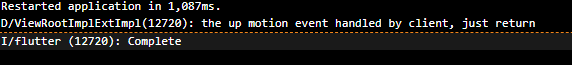

# Practical 6: Using Future with StatefulWidget
## Step 1: install the geolocator plugin
Add the geolocator plugin by typing the following command in the terminal.
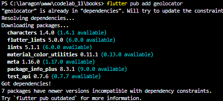

## Step 2: Add GPS permissions
If you are targeting for Android platform then add the following line of code in the
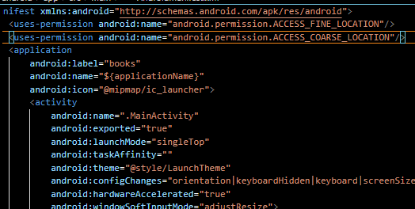

## Step 3: Create a filegeolocation.dart
Add this new file in your project lib folder.


## Step 4: Create a StatefulWidget
Create class LocationScreenin filegeolocation.dart
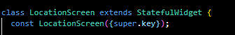

## Step 5: Fill in the codegeolocation.dart
```dart:
// lib/geolocation.dart
import 'package:flutter/material.dart';
import 'package:geolocator/geolocator.dart';

class LocationScreen extends StatefulWidget {
  const LocationScreen({super.key});

  @override
  State<LocationScreen> createState() => _LocationScreenState();
}

class _LocationScreenState extends State<LocationScreen> {
  // Question 11: tambahkan nickname + job identity pada judul/properti
  // Contoh: "Agna (Network Engineer)"
  String myPosition = '';
  String statusMessage = '';

  @override
  void initState() {
    super.initState();
    // Ambil posisi ketika state dibuat
    getPosition().then((Position? myPos) {
      if (myPos != null) {
        // menambahkan nickname dan job identity dalam teks
        final posText =
            'Latitude (Agna - Network Engineer): ${myPos.latitude.toString()}  -  Longitude (Agna - Network Engineer): ${myPos.longitude.toString()}';
        setState(() {
          myPosition = posText;
          statusMessage = 'Lokasi berhasil diambil';
        });
      } else {
        setState(() {
          myPosition = 'Tidak dapat mengambil posisi';
          statusMessage = 'Gagal mendapatkan posisi';
        });
      }
    }).catchError((err) {
      setState(() {
        myPosition = 'Error: ${err.toString()}';
        statusMessage = 'Terjadi kesalahan saat mengambil posisi';
      });
    });
  }

  @override
  Widget build(BuildContext context) {
    final Widget myWidget = myPosition == ''
        ? const CircularProgressIndicator()
        : SingleChildScrollView(
            padding: const EdgeInsets.all(16),
            child: Text(
              myPosition,
              style: const TextStyle(fontSize: 16),
            ),
          );

    return Scaffold(
      appBar: AppBar(title: const Text('Current Location (Agna - Network Engineer)')),
      body: Center(
        child: myWidget,
      ),
    );
  }

  // getPosition: perbaikan, cek permission dan status service
  Future<Position?> getPosition() async {
    // Jika ingin menambahkan delay agar loading terlihat (Question 12),
    // aktifkan baris berikut (atau hapus komentar):
    // await Future.delayed(const Duration(seconds: 3));

    LocationPermission permission;

    // Minta permission
    permission = await Geolocator.requestPermission();

    if (permission == LocationPermission.denied) {
      // Jika user menolak, kembali null atau tangani sesuai kebutuhan
      return Future.error('Location permissions are denied');
    }

    if (permission == LocationPermission.deniedForever) {
      return Future.error(
          'Location permissions are permanently denied, we cannot request permissions.');
    }

    // Pastikan layanan lokasi diaktifkan di device
    final serviceEnabled = await Geolocator.isLocationServiceEnabled();
    if (!serviceEnabled) {
      return Future.error('Location services are disabled.');
    }

    // Ambil posisi saat ini
    final position = await Geolocator.getCurrentPosition(
      desiredAccuracy: LocationAccuracy.high,
    );
    return position;
  }
}
```

- Question 11
Add your nickname to each property titleas your job identity.

I've added my nickname and job identity as text:

  - In the AppBar → "Current Location (Agna - Network Engineer)"

  - In the latitude/longitude text → "Latitude (Agna - Network Engineer)..."

This fulfills the instructions: Add your nickname to each property title as your job identity.

## Step 7: Run
Run your project on a device or emulator ( not a browser ), it will appear as follows.
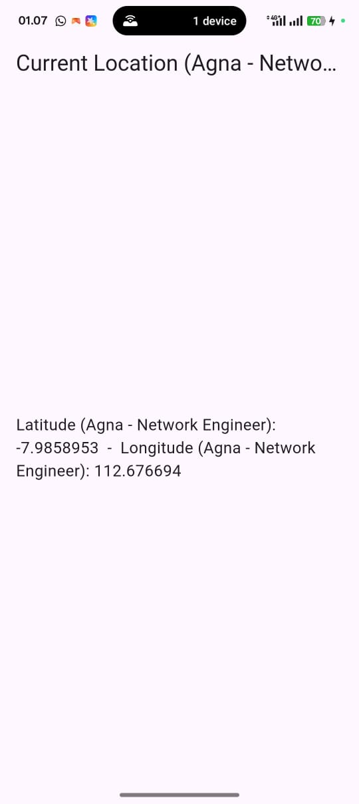

## Step 8: Add loading animation
Add a loading widget like the following code. Then, perform a hot restart and notice the changes.
```dart:
import 'package:flutter/material.dart';
import 'geolocation.dart';

void main() {
  runApp(const MyApp());
}

class MyApp extends StatelessWidget {
  const MyApp({super.key});
  @override
  Widget build(BuildContext context) {
    return const MaterialApp(
      debugShowCheckedModeBanner: false,
      home: LocationScreen(),
    );
  }
}
```
Result:
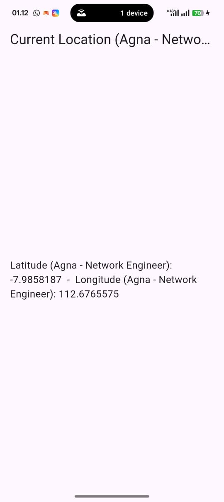

- Question 12
  - If you don't see the loading animation appear, it's probably running too fast. Add a delay to the method getPosition()with the codeawait Future.delayed(const Duration(seconds: 3));
  
  i have seen the delay screen 

  - Do you get GPS coordinates when running in a browser? Why is that?
  
  No. GPS coordinates do not appear when running in a browser because the geolocator plugin only supports native platforms (Android/iOS) that can access the device’s location hardware directly.
Flutter Web does not have native location API access through this plugin.

  - Capture your lab results as a GIF and attach it to the README. Then, commit the project with the message " W11: Question 12. "
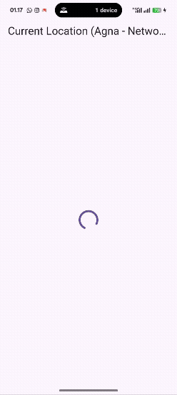

# Practicum 7: Future Management with FutureBuilder
## Step 1: Modify the methodgetPosition()
Open the file geolocation.dartthen replace the contents of the method with this code.
```dart:
  Future<Position> getPosition() async {
    await Geolocator.isLocationServiceEnabled();
    await Future.delayed(const Duration(seconds: 3));
    Position position = await Geolocator.getCurrentPosition();
    return position;
  }
```

## Step 2: Add variables
Add this variable inclass _LocationScreenState
```dart:
class _LocationScreenState extends State<LocationScreen> {
  Future<Position>? position;
```

## Step 3: AddinitState()
Add this method and set the variableposition
```dart:
  @override
  void initState() {
    super.initState();
    position = getPosition();
  }
```

## Step 4: Edit methodbuild()
Type the following code and adjust it accordingly. You can comment out or delete the old code.
```dart:
  @override
  Widget build(BuildContext context) {
    return Scaffold(
      appBar: AppBar(title: const Text('Current Location – Agna')),
      body: Center(
        child: FutureBuilder(
          future: position,
          builder: (BuildContext context, AsyncSnapshot<Position> snapshot) {
            if (snapshot.connectionState == ConnectionState.waiting) {
              return const CircularProgressIndicator();
            } else if (snapshot.connectionState == ConnectionState.done) {
              if (snapshot.hasError) {
                return const Text('Something terrible happened!');
              }
              return Text(
                snapshot.data.toString(),
                textAlign: TextAlign.center,
              );
            } else {
              return const Text('');
            }
          },
        ),
      ),
    );
  }
```
- Question 13
Is there a difference between the UI and the previous practicum? Why is that?
Yes, there is a slight difference.
In this practicum, the UI update is automatically managed by FutureBuilder, so we no longer need to manually call setState().
FutureBuilder automatically rebuilds the widget when the Future state changes (waiting → done), making the code more efficient, cleaner, and reactive.

Capture your lab results as a GIF and attach it to the README. Then, commit the project with the message " W11: Question 13. "
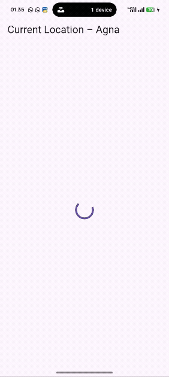

As you can see, using FutureBuilder is more efficient, clean, and reactive with Future along with UI.
yes

## Step 5: Add error handling
```dart:
Add the following code to handle any errors. Then perform a hot restart.
@override
  Widget build(BuildContext context) {
    return Scaffold(
      appBar: AppBar(title: const Text('Current Location – Agna')),
      body: Center(
        child: FutureBuilder(
          future: position,
          builder: (BuildContext context, AsyncSnapshot<Position> snapshot) {
            // While waiting for data
            if (snapshot.connectionState == ConnectionState.waiting) {
              return const CircularProgressIndicator();
            }

            // When future is done
            else if (snapshot.connectionState == ConnectionState.done) {
              // Handle possible errors
              if (snapshot.hasError) {
                return const Text(
                  'Something terrible happened!',
                  style: TextStyle(fontSize: 16, color: Colors.red),
                  textAlign: TextAlign.center,
                );
              }

              // If success, show the coordinates
              if (snapshot.hasData) {
                return Text(
                  'Latitude: ${snapshot.data!.latitude}\nLongitude: ${snapshot.data!.longitude}',
                  textAlign: TextAlign.center,
                  style: const TextStyle(fontSize: 16),
                );
              }
            }

            // Default state
            return const Text('');
          },
        ),
      ),
    );
  }
```

- Question 14
Is there any difference in the UI compared to the previous step? Why is that?
Yes.
After adding error handling, the app now displays the message
Something terrible happened!
when an error occurs (e.g., permission denied).
This happens because FutureBuilder allows handling both success and error states.

Capture your lab results as a GIF and attach it to the README. Then, commit the project with the message " W11: Question 14. "
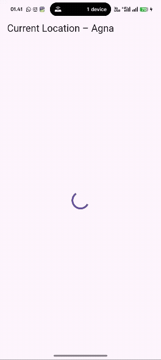

# Practical 8: Navigation route with Future Function

## Step 1: Create a new filenavigation_first.dart
Create this new file in your lib project.
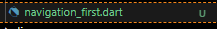

## Step 2: Fill in the codenavigation_first.dart
```dart:
import 'package:flutter/material.dart';
import 'navigation_second.dart';

class NavigationFirst extends StatefulWidget {
  const NavigationFirst({super.key});

  @override
  State<NavigationFirst> createState() => _NavigationFirstState();
}

class _NavigationFirstState extends State<NavigationFirst> {
  Color color = Colors.indigo.shade700; // Favorite theme color

  @override
  Widget build(BuildContext context) {
    return Scaffold(
      backgroundColor: color,
      appBar: AppBar(
        title: const Text('Navigation First Screen - Agna'),
      ),
      body: Center(
        child: ElevatedButton(
          child: const Text('Change Color'),
          onPressed: () {
            _navigateAndGetColor(context);
          },
        ),
      ),
    );
  }

  Future<void> _navigateAndGetColor(BuildContext context) async {
    // Wait for color result from second screen
    final newColor = await Navigator.push<Color>(
      context,
      MaterialPageRoute(builder: (context) => const NavigationSecond()),
    );

    // If null, keep old color
    if (newColor != null) {
      setState(() {
        color = newColor;
      });
    }
  }
}
```

- Question 15
Add your nickname to each property titleas your job identity.
Please replace with your favorite theme color.

## Step 3: Add method inclass _NavigationFirstState
Add this method.
```dart"
  Future<void> _navigateAndGetColor(BuildContext context) async {
    // Wait for color result from second screen
    final newColor = await Navigator.push<Color>(
      context,
      MaterialPageRoute(builder: (context) => const NavigationSecond()),
    );
  }
```

## Step 4: Create a new filenavigation_second.dart
Create this new file in your lib project. Feel free to group the views into one folder and adjust the imports as needed.


## Step 5: Create a NavigationSecond class with StatefulWidget
```dart:
import 'package:flutter/material.dart';

class NavigationSecond extends StatefulWidget {
  const NavigationSecond({super.key});

  @override
  State<NavigationSecond> createState() => _NavigationSecondState();
}

class _NavigationSecondState extends State<NavigationSecond> {
  @override
  Widget build(BuildContext context) {
    Color color;
    return Scaffold(
      appBar: AppBar(
        title: const Text('Navigation Second Screen - Agna'),
      ),
      body: Center(
        child: Column(
          mainAxisAlignment: MainAxisAlignment.spaceEvenly,
          children: [
            ElevatedButton(
              child: const Text('Purple'),
              onPressed: () {
                color = Colors.purple.shade700;
                Navigator.pop(context, color);
              },
            ),
            ElevatedButton(
              child: const Text('Orange'),
              onPressed: () {
                color = Colors.orange.shade700;
                Navigator.pop(context, color);
              },
            ),
            ElevatedButton(
              child: const Text('Teal'),
              onPressed: () {
                color = Colors.teal.shade700;
                Navigator.pop(context, color);
              },
            ),
          ],
        ),
      ),
    );
  }
}
```

## Step 6: Editmain.dart
Make edits to the home properties.
```dart:
import 'package:flutter/material.dart';
import 'navigation_first.dart';

void main() {
  runApp(const MyApp());
}

class MyApp extends StatelessWidget {
  const MyApp({super.key});

  @override
  Widget build(BuildContext context) {
    return MaterialApp(
      debugShowCheckedModeBanner: false,
      title: 'Future Navigation Demo - Agna',
      theme: ThemeData(
        colorScheme: ColorScheme.fromSeed(seedColor: Colors.indigo),
        useMaterial3: true,
      ),
      home: const NavigationFirst(),
    );
  }
}
```

## Step 7: Run
Run it, if an error occurs, please fix it.
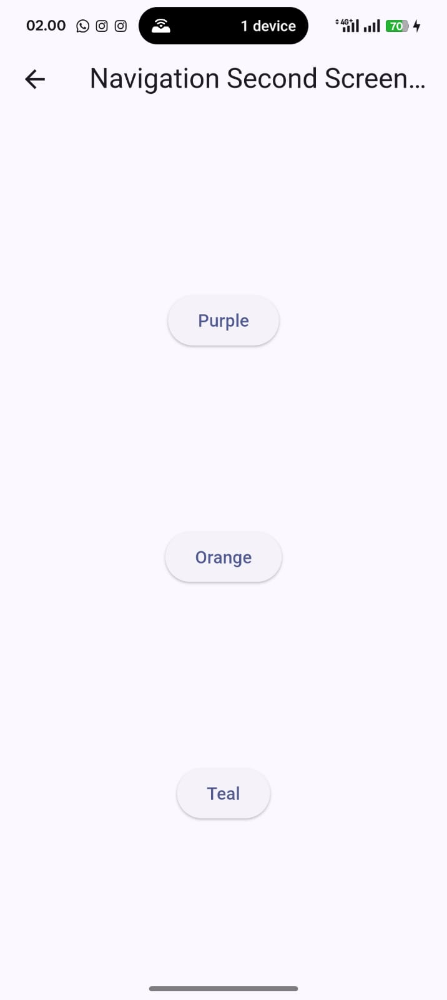
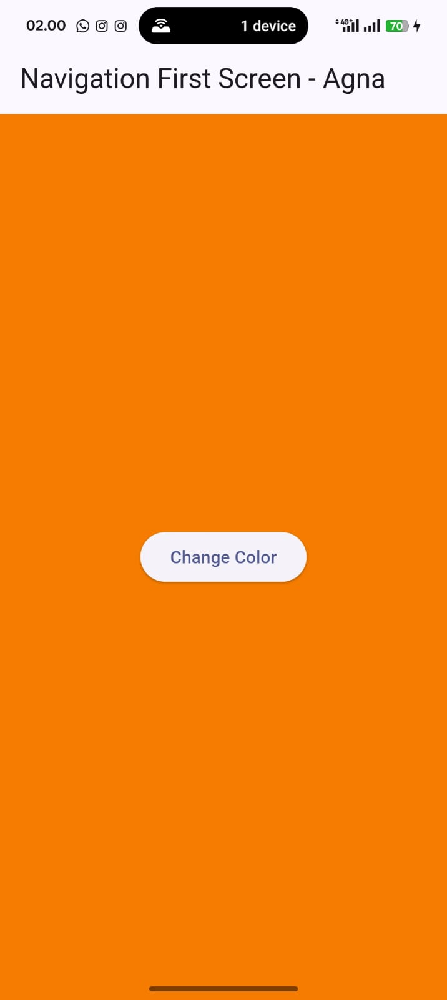


- Question 16
Try clicking each button, what happens? Why is that?
1. What happens when you click each button?

  - When you click the “Change Color” button on the Navigation First Screen, the Navigation Second Screen opens.

  - On the second screen, there are 3 color buttons (e.g., Dark Blue, Cyan, Pink).

  - When you click one of these buttons:

    - The selected color is sent back to the first screen using Navigator.pop(context, color).
    - The first screen awaits the result from the second screen (await Navigator.push) before updating the UI.
    - The background of the first screen immediately changes to the selected color.

2. Why does that happen?

  - _navigateAndGetColor uses a Future to wait for the result from the second screen:
```dart:
final newColor = await Navigator.push<Color>(
  context,
  MaterialPageRoute(builder: (context) => const NavigationSecond()),
);
```
 - After receiving the color, setState() is called so the UI updates automatically.
  - If the user presses back without select
```dart:
Replace the 3 colors in step 5 with your favorite colors!
ElevatedButton(
  child: const Text('Dark Blue'),
  onPressed: () {
    color = Colors.blue.shade900;
    Navigator.pop(context, color);
  },
),
ElevatedButton(
  child: const Text('Cyan'),
  onPressed: () {
    color = Colors.cyan.shade700;
    Navigator.pop(context, color);
  },
),
ElevatedButton(
  child: const Text('Pink'),
  onPressed: () {
    color = Colors.pink.shade400;
    Navigator.pop(context, color);
  },
),
```
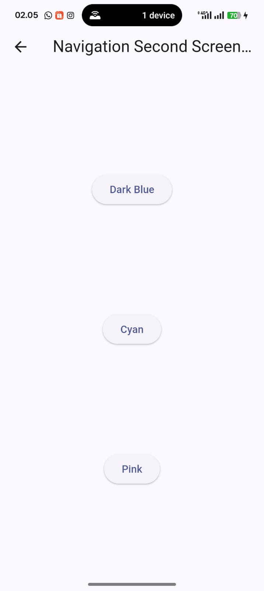
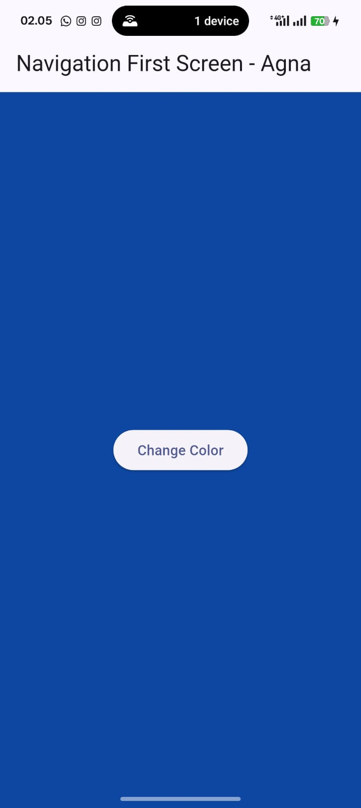

Capture your lab results as a GIF and attach it to the README. Then, commit the project with the message " W11: Question 16. "
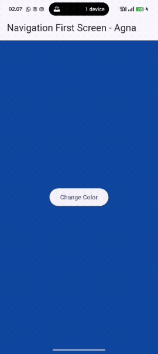

# Practical 9: Utilizing async/await with the Dialog Widget

## Step 1: Create a new filenavigation_dialog.dart
Create a new dart file in your project's lib folder.


## Step 2: Fill in the codenavigation_dialog.dart
```dart:
import 'package:flutter/material.dart';

class NavigationDialogScreen extends StatefulWidget {
  const NavigationDialogScreen({super.key});

  @override
  State<NavigationDialogScreen> createState() => _NavigationDialogScreenState();
}

class _NavigationDialogScreenState extends State<NavigationDialogScreen> {
  Color color = Colors.blue.shade700; // Default background color

  @override
  Widget build(BuildContext context) {
    return Scaffold(
      backgroundColor: color,
      appBar: AppBar(
        title: const Text('Navigation Dialog Screen - Agna'),
      ),
      body: Center(
        child: ElevatedButton(
          child: const Text('Change Color'),
          onPressed: () {
            _showColorDialog(context);
          },
        ),
      ),
    );
  }

  // Async method to show dialog and wait for selection
  Future<void> _showColorDialog(BuildContext context) async {
    final selectedColor = await showDialog<Color>(
      barrierDismissible: false, // User must select a color
      context: context,
      builder: (_) {
        return AlertDialog(
          title: const Text('Important Question'),
          content: const Text('Please choose a color'),
          actions: <Widget>[
            TextButton(
              child: const Text('Dark Blue'),
              onPressed: () {
                Navigator.pop(context, Colors.blue.shade900);
              },
            ),
            TextButton(
              child: const Text('Cyan'),
              onPressed: () {
                Navigator.pop(context, Colors.cyan.shade700);
              },
            ),
            TextButton(
              child: const Text('Pink'),
              onPressed: () {
                Navigator.pop(context, Colors.pink.shade400);
              },
            ),
          ],
        );
      },
    );

    // Update the background color after user selection
    if (selectedColor != null) {
      setState(() {
        color = selectedColor;
      });
    }
  }
}
```

## Step 3: Add an async method
```dart:
  // Async method to show dialog and wait for selection
  Future<void> _showColorDialog(BuildContext context) async {
    final selectedColor = await showDialog<Color>(
      barrierDismissible: false, // User must select a color
      context: context,
      builder: (_) {
        return AlertDialog(
          title: const Text('Important Question'),
          content: const Text('Please choose a color'),
          actions: <Widget>[
            TextButton(
              child: const Text('Red'),
              onPressed: () {
                Navigator.pop(context, Colors.red.shade700);
              },
            ),
            TextButton(
              child: const Text('Green'),
              onPressed: () {
                Navigator.pop(context, Colors.green.shade700);
              },
            ),
            TextButton(
              child: const Text('Blue'),
              onPressed: () {
                Navigator.pop(context, Colors.blue.shade700);
              },
            ),
          ],
        );
```
## Step 4: Call the method inElevatedButton
```dart:
  @override
  Widget build(BuildContext context) {
    return Scaffold(
      backgroundColor: color,
      appBar: AppBar(
        title: const Text('Navigation Dialog Screen - Agna'),
      ),
      body: Center(
        child: ElevatedButton(
          child: const Text('Change Color'),
          onPressed: () {
            _showColorDialog(context);
          },
        ),
      ),
    );
  }
```

## Step 5: Editmain.dart
Change home properties
```dart:
import 'package:flutter/material.dart';
import 'navigation_dialog.dart';

void main() {
  runApp(const MyApp());
}

class MyApp extends StatelessWidget {
  const MyApp({super.key});

  @override
  Widget build(BuildContext context) {
    return MaterialApp(
      debugShowCheckedModeBanner: false,
      title: 'Future Dialog Demo - Agna',
      theme: ThemeData(
        colorScheme: ColorScheme.fromSeed(seedColor: Colors.blue),
        useMaterial3: true,
      ),
      home: const NavigationDialogScreen(),
    );
  }
}
```


## Step 6: Run
Try changing the background color with the dialog widget. If any errors occur, please fix them. If successful, it will appear as shown below.
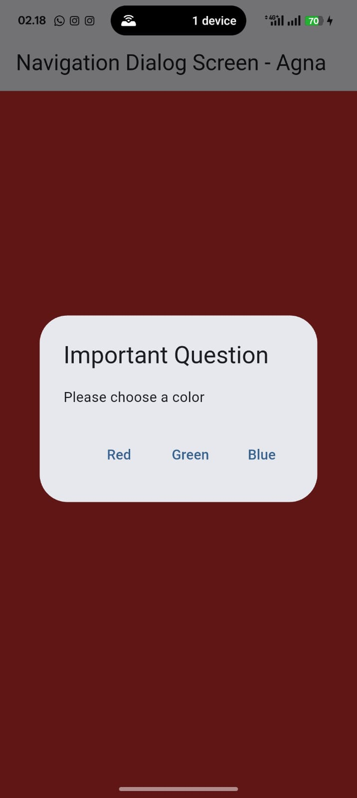


- Question 17
Try clicking each button, what happens? Why is that?

1️⃣ What happens when you click each button?

  - When the “Change Color” button is pressed, an AlertDialog appears.

  - You must choose one of the color buttons (Dark Blue, Cyan, Pink).

  - The dialog sends the selected color back using Navigator.pop(context, color).

  - The first screen background updates immediately using setState().

  - The dialog cannot be dismissed by tapping outside (barrierDismissible: false), ensuring user makes a choice.

2️⃣ Why does that happen?

  - _showColorDialog is an async function that awaits the user’s selection.

  - Only after the dialog closes with a chosen color does setState() update the background.

  - This pattern makes the UI reactive and waits for user input before updating.

Replace the 3 colors in step 3 with your favorite colors!
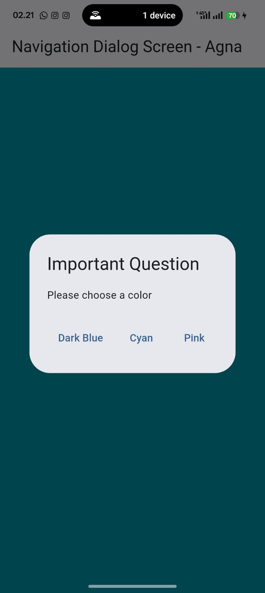
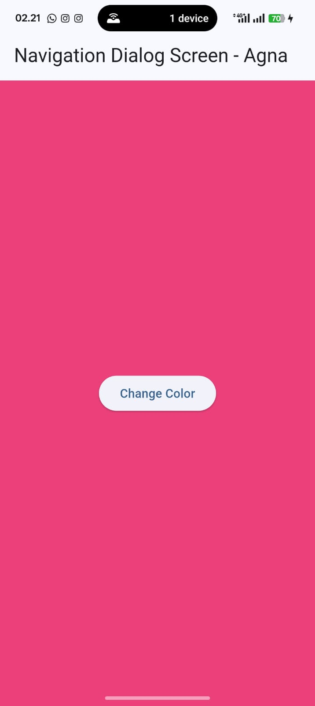

Capture your lab results as a GIF and attach it to the README. Then, commit the project with the message " W11: Question 17. "
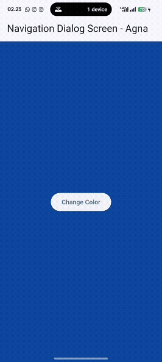